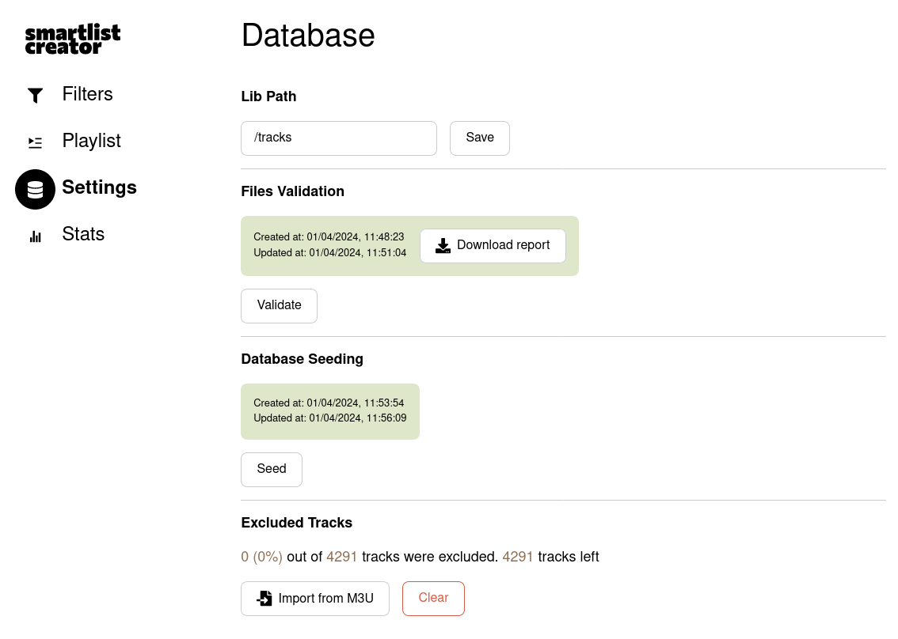
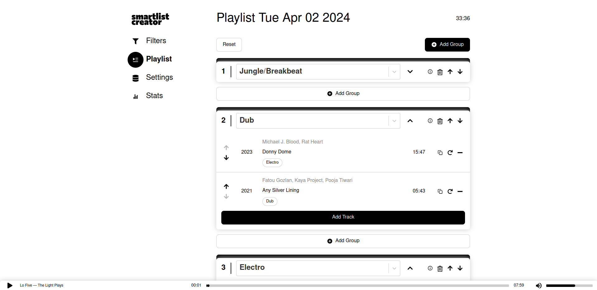

# About

Smart playlist generator for radio stations. Created to speed up playlist creation for podcasts/mixes.

# API endpoints documentation

All API endpoints are documented using OpenAPI spec in [doc/open-api.yml](./doc/open-api.yml)

# How to start the app

```shell
docker compose -f docker-compose.dev.yml up dev_postgres
docker compose -f docker-compose.dev.yml up dev_api
docker compose -f docker-compose.dev.yml up dev_client

# Run migration from the inside of the dev_api container to c0reate db tables
docker container exec -it dev_api sh
yarn run migratesql up # note: 'up' is an arg to the migratesql script
```

# Debugging

* Database container: 
  ```
  docker container exec -it dev_postgres bash
  psql -p 5432 -h localhost -U ikar -d ikar # see the actual credentials in /postgres/docker/.dev.env
  ```
* API container: 
  ```
  curl "localhost:3000/api/v1/stream" --output - # to read binary stream with curl
  ```

# Video demo

[Video demo](./doc/demo.webm)


# UI screenshots


---


---



---



---


---


