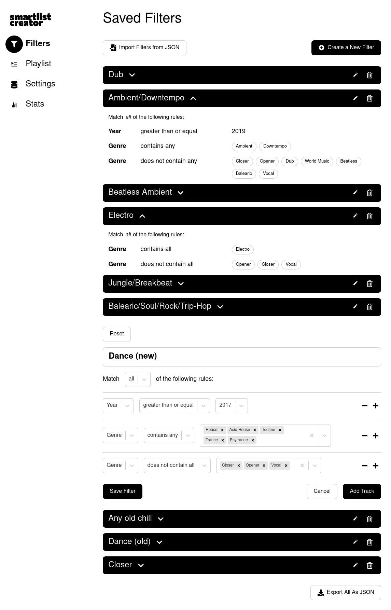

# v2 (`v2` branch)

Rewrite/redesign of API.

Essential routes:

* `/tracks/excluded`
  * get - lists all excluded, returns as m3u 
  * post - send m3u list to add to excluded. returns how many tracks have been added and how many have not 
  * delete/patch - provide m3u list with all tracks to remove from excluded
  
Secondary routes:

* `/playlists` + `?type=m3u`
  * post - { title: string, queryIds: number[] }, returns a playlist consisting of tracks from each executed query, every  time we send request, the playlist is regenerated
  * get - returns all generated playlists history [ { id: number,  } ]

* `/tracks/search`
  * post - { limit: numbers, genres, years, bpm: number, bpmPrecision: number, sortd: asc, desc } or send search by text string and fields to search in (label, artist, album) returns { queryId: number, results: [ tracks ] }

* `/tracks/search/saved`
  * get - returns query history where every executed query has an id. if add ?title=true , returns only named queries
  * delete - delete all queries or ?title=true

* `/tracks/search/saved/:id`
  * post - to set query title
  * get - to return query
  * delete
  * put


# v1 (`main` branch)

## About

Smart playlist generator for radio stations. Created to speed up playlist creation for podcasts/mixes.

## API endpoints documentation

All API endpoints are documented using OpenAPI spec in [doc/open-api.yml](./doc/open-api.yml)

## How to start the app

```shell
docker compose -f docker-compose.dev.yml up dev_postgres
docker compose -f docker-compose.dev.yml up dev_api
docker compose -f docker-compose.dev.yml up dev_client

# Run migration from the inside of the dev_api container to c0reate db tables
docker container exec -it dev_api sh
yarn run migratesql up # note: 'up' is an arg to the migratesql script
```

## Debugging

* Database container: 
  ```
  docker container exec -it dev_postgres bash
  psql -p 5432 -h localhost -U ikar -d ikar # see the actual credentials in /postgres/docker/.dev.env
  ```
* API container: 
  ```
  curl "localhost:3000/api/v1/stream" --output - # to read binary stream with curl
  ```

## Video demo

[Video demo](./doc/demo.webm)


## UI screenshots



---


---


---


---


---


